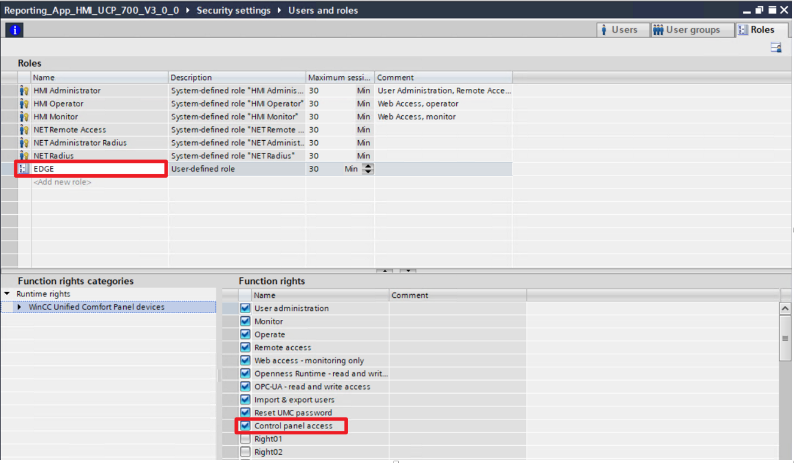

# EDGE Report Unified

The report-unified app allows you to generate dynamic time-based report documents containing data from the WinCC Unified supervisor system, only for **Unified Comfort Panels** devices with Industrial Edge functionality activated.

For Italian translated guide, see the [README_it](./docs/README_it.pdf) file.


## Table of Contents

- [EDGE Report Unified](#edge-report-unified)
  - [Table of Contents](#table-of-contents)
  - [Introduction](#introduction)
  - [Before Starting](#before-starting)
  - [App Requirements](#app-requirements)
    - [Hardware Requirements](#hardware-requirements)
    - [Software Requirements](#software-requirements)
  - [App Installation](#app-installation)
    - [Prerequisites](#prerequisites)
    - [Load App on Unified Comfort Panel](#load-app-on-unified-comfort-panel)
  - [Application Example](#application-example)
    - [Goal of the application](#goal-of-the-application)
    - [Prerequisites](#prerequisites-1)
    - [WinCC Unified TIA Portal Project Upload](#wincc-unified-tia-portal-project-upload)
    - [Creating a new report](#creating-a-new-report)
  - [App Configuration](#app-configuration)
    - [Edge App Configuration](#edge-app-configuration)
    - [Archived Tags WinCC Name Syntax](#archived-tags-wincc-name-syntax)
    - [Editing the Configuration File](#editing-the-configuration-file)
  - [WinCC Unified Configuration](#wincc-unified-configuration)
    - ["EdgeReportLibrary" Library Import](#edgereportlibrary-library-import)
    - [Table "EdgeReportTags" variables](#table-edgereporttags-variables)
    - [Report Start/End and Template Name Controls](#report-startend-and-template-name-controls)
    - ["EdgeReportGlobalModule" Global Scripts Module](#edgereportglobalmodule-global-scripts-module)
    - ["EdgeReportTriggerTask" Scheduled Task](#edgereporttriggertask-scheduled-task)
  - [Templates Configuration](#templates-configuration)
    - [Prerequisites](#prerequisites-2)
    - [Report Data Generated Application Example](#report-data-generated-application-example)
    - [Markers for Realtime Tags](#markers-for-realtime-tags)
    - [Markers for Archived Tags](#markers-for-archived-tags)
    - [Markers for Archived Alarms](#markers-for-archived-alarms)
    - [Loading template files in the application](#loading-template-files-in-the-application)
  - [Edge Enablement on Unified Comfort Panels](#edge-enablement-on-unified-comfort-panels)
  - [Edge User Authentication on Unified Comfort Panels](#edge-user-authentication-on-unified-comfort-panels)
  - [How the App is built](#how-the-app-is-built)
    - [```docker-compose.yml```](#docker-composeyml)
    - [```Dockerfile```](#dockerfile)
  - [Import in Edge App Publisher](#import-in-edge-app-publisher)
  - [References](#references)
  - [Release History](#release-history)
  - [License](#license)
  - [Contributing](#contributing)
  - [Contacts](#contacts)

## Introduction

Reports are dynamically generated based on documents called **Templates**, which can have formats including *.xlsx, .docx, .pptx, .ods, .odt, .xml* and *.xhtml*. Combined with *LibreOffice™* or *MS Office™* features, you can easily create report documents with:

- Graphs and Images
- Headers, footers
- Dynamic tables automatically repeated between pages
- Insert calculated fields

The data included in the templates for the creation of reports can come from three different **sources** of the WinCC Unified environment:

- **Archived Tags**, in the defined time range, present in databases located on SD Card or USB and managed through the standard WinCC Unified Logging features;
- **Realtime Tags**, acquiring their last value at the time of report creation;
- **Archived Alarms**, in the defined time range, present in the databases located on SD Card or USB and managed through the standard WinCC Unified Logging features.

Templates dynamize their content according to specific markers with a specific syntax defined by the [Carbone JS library](https://carbone.io/) used by report-unified application.

Carbone JS finds all **markers** identified with ```{}``` in the template document *(.xlsx, .odt, .docx, ...)* and replaces these markers with the data according to the syntax of the markers inserted. 
To clearly understand how Carbone JS works visit the official [CarboneJS Quickstart Guide](https://carbone.io/documentation.html#quick-start).

The generated report files will be available on WinCC Unified's **USB storage media** or **SD Card**, on the **Edge Management Web Portal** and optionally can also be sent to a **Windows Shared folder** on a Windows system remotely connected to the Unified Comfort Panel device.

## Before Starting

This guide describes how to use and install the report-unified App.

Check the requirements on chapter [App Requirements](#app-requirements) before proceeding with the installation. Details for the installation procedure can be found on chapter [App Installation](#app-installation).

The application is provided with an example of two preloaded *.xlsx* format Templates and with a configuration that, in combination with the provided WinCC Unified project, allows to generate two different reports that show how to exploit the application. For more details visit chapter [Application Example](#application-example).

To integrate the report-unified application within a **customized WinCC Unified project**, it is necessary to use a Unified Comfort Panel device and insert some elements necessary for the app to work. These elements can be copied from the *"EdgeReportLibrary"* library provided with the app. For more details please refer to chapter [WinCC Unified Configuration](#wincc-unified-configuration).

Configuration of WinCC Unified tags and all other application parameters should follow the directions provided in chapter [App Configuration](#app-configuration).

Templates files can be created and configured according to the indication provided in chapter [Templates Configuration](#templates-configuration).

## App Requirements

In order to run this Edge App, the selected Edge System need to satisfy the following requirements:

| Description                    |           |
|--------------------------------|-----------|
| Available Working Memory (RAM) | >= 768 MB |
|                                |           |

### Hardware Requirements

- The report-unified app is only compatible with **WinCC Unified Panels** devices that have **SIMATIC Edge** functionality enabled. For details on how to enable Edge functionality see chapter [Edge Enablement on Unified Comfort Panels](#edge-enablement-on-unified-comfort-panels).  

### Software Requirements

- The report-unified app requires **768MB** of **RAM** to run. The current limit of RAM available to Industrial Edge applications on WinCC Unified Panels devices is 768MB and for this reason no other Edge application can be running in parallel with the report-unified application;
- The report-unified app requires an active and properly configured **WinCC Unified project** present on the WinCC Unified Panel device. For details on how to integrate the report-unified app into a new WinCC Unified project see chapter [WinCC Unified Configuration](#wincc-unified-configuration).
WinCC Unified and the report-unified app requires to use the Engineering software **TIA Portal WinCC Unified V16** or later versions.

## App Installation

The report-unified application comes with the pre-built app package ```report-unified_x.x.x.app``` (depending on the version provided) that can be installed specifically on **Unified Comfort Panel** devices using **SIMATIC Edge**.

### Prerequisites

- A Unified Comfort Panel device with the SIMATIC Edge feature enabled (see chapter [Edge Enablement on Unified Comfort Panels](#edge-enablement-on-unified-comfort-panels));
- At least one WinCC user must be enabled to access the SIMATIC Edge portal (see chapter [Edge User Authentication on Unified Comfort](#edge-user-authentication-on-unified-comfort-panels)).

### Load App on Unified Comfort Panel

1. Copy the downloaded file of **report-unified_x.x.x.app** (depending on the *x.x.x* version) to your PC or USB / SD Card for Unified Comfort Panel.
2. Open the **Edge Management** web page of the Unified Comfort Panels device via the address ```https://<unified-panel-address>/``` and **login** with the enabled WinCC user.

3. Import the ```report-unified_x.x.x.app``` file using the **"Import Offline"** button, selecting via **"Browse"** the file on your PC. Alternatively, you can access files from USB devices or SD Cards via **"Storage Media"**.

4. Wait for the app to be installed. You can check the status via the **"Tasks"** button at the top right

5. Check in the **"Management"** section that the app is running correctly:

6. Now you can use configure the application to create **Report files**.

## Application Example

The report-unified application is provided in conjunction with a TIA Portal V16 project that allows you to test the full operation of the application. Below are the steps to follow to run the provided application example.

### Goal of the application

Through the following example it will be possible to create two reports with:

- two different **Groups** of Archived Tags named **"ProductionData"** and **"TankData"**.These two groups will contain the data of two pairs of Archived Tags *"GoodPieces:LT_1", "BadPieces:LT_1", "WaterLevel:LT_1" and "OilLevel:LT_1"*.
- A list of variables **"realtime"** values
- All the archived **alarms**

Below a preview of generated "Production" and "Tanks" reports:


### Prerequisites

- The report-unified application must be **installed** on the Unified Comfort Panel device. For more details follow chapter [App Installation](#app-installation).
- In order to get the report files also on **Windows shared folder** it is necessary to adapt the ```"share"``` property of the app configuration file. See details in chapter [App Configuration](#app-configuration).
- To use the following project you need the Engineering software **TIA Portal WinCC Unified V16** or later versions.
- At least one **Unified Comfort Panel MTPxxx** device is required to use the project.
The included TIA Portal project is programmed for use with an MTP700 Unified Comfort Panel device. It is possible to switch devices to different versions of the Unified Comfort Panels MTPxxx family using the **"Switch Device"** feature of TIA Portal Engineering V16.

### WinCC Unified TIA Portal Project Upload

The included TIA Portal project is provided as an archive with a **.zap16** extension. Therefore, it will be necessary to unarchive it.

1. Use the provided archived project file ```Reporting_App_HMI_UCP_700_V3_0_0.zap16```. You can open the file with TIA Portal by double-clicking it.
2. Upon opening you will be prompted for the save path of the retrieved TIA Portal project. Choose the folder of interest.
3. Then navigate to the Project View and in the **"Devices and Networks"** section configure the MTP700 device named **"HMI_1"** according to your network and hardware:

4. Once you have adapted the project for your Unified Comfort Panel device, download the project using the **"Download"** button.

5. Start the project on the Unified Comfort Panel device. The following **"01 Tanks"** screen will be displayed.

6. Now you can create dynamic reports using the functionality offered by the sample project.

### Creating a new report

The example project has several tags that are dynamically generated automatically, such as the *"WaterLevel"* and *"TankLevel"* tank levels. It is also possible to generate data manually, as in the case of the Production data visible on the **"02 Production"** screen:


On the **"05 ReportSettings"** screen, it is possible to set the time range of interest for the report and which Template file will be used to generate the report thanks to the dedicated default buttons:

- *"1h"* (1 hour less than the pressing instant)
- *"1d"* (24 hours less than the time of pressing)
- *"Today"* (full day)
- *"Template_Production.xlsx"* (set the file as template)
- *"Template_Tanks.xlsx"* (sets the file as template)


The screen also contains a **"Delete All Saved Reports"** button that **permanently** deletes all the reports saved in the various folders used by the application.

By pressing the **"Create Report"** button on all the screens of the sample project, it is possible to create the report file with the parameters set in the chapter described in this guide. The report files can be viewed by **downloading** them from the Edge Management portal, from the Management menu, inside the ```publish/``` volume.


The files will also be available on the **storage media** (USB or SD Card) used by WinCC Unified and, if it is enabled and configured, on the **Windows shared folder** of interest.
The files are available both in the original template file format and in **PDF** format.

## App Configuration

### Edge App Configuration

To configure the behavior of the report-unified application, it is necessary to use the configuration file named ```config.json```, which is present in the volume ```cfg-data/``` mounted on the system by the application.

Below is the configuration file used for the application example available in this guide in the [Application Example](#application-example) chapter:

```json
{
  "storagePortConfig": "X61",
  "triggerTagConfig": "TriggerTag1",
  "startTimeTag": "ReportStartTimeTag",
  "endTimeTag": "ReportEndTimeTag",
  "templateFilenameTag": "TemplateFilenameTag",
  "reportFilenameTag": "ReportFilenameTag",
  "triggerDeleteReports": "TriggerDeleteReports",
  "loggingTags": [
    {
      "id": "ProductionData",
      "tags": [
        "GoodPieces:LT_1",
        "BadPieces:LT_1"
      ]
    },
    {
      "id": "TankData",
      "tags": [
        "WaterLevel:LT_1",
        "OilLevel:LT_1"
      ]
    }
  ],
  "tags": [
    "Datetime",
    "ID",
    "WaterBottles",
    "ColaBottles",
    "OrangeBottles",
    "TotalPieces",
    "Quality",
    "Temperature",
    "Pressure"
  ],
  "alarms": true,
  "share": {
    "enabled": true,
    "sharedFolderUrl": "//192.168.1.99/iot_share",
    "sharedFolderUser": "iot",
    "sharedFolderPassword": "iot"
  }
}

```

For details on the meaning of the properties in the configuration file, see the **table** below. The specified properties are **all mandatory** for the app in order to make it run correctly:

| **Property Name**  | **Type**   | **Description**   | **Application Example Value** |
|--------------------|------------|-------------------|-------------------------------|
| *storagePortConfig*    | String | Indicates which storage port (USB or SD Card) is used by WinCC Unified for the Tags and Alarms Archive functions. The storage connected to this port will be needed for saving report files. The port can be one of your choice from: *X51, X52, X61, X62, X63,X64*| ```"X61"``` |
| *triggerTagConfig*     | String | Name of the WinCC Unified Tag that identifies the Trigger variable for report generation. For more details on this tag visit the [WinCC Unified Configuration](#wincc-unified-configuration) section. | ```"TriggerTag1"``` |
| *startTimeTag*         | String | Name of the WinCC Unified Tag that identifies the initial time instant of the report. For more details on this tag visit the [WinCC Unified Configuration](#wincc-unified-configuration) section.  | ```"ReportStartTimeTag"``` |
| *endTimeTag*           | String | Name of the WinCC Unified Tag that identifies the final time instant of the report. For more details on this tag visit the [WinCC Unified Configuration](#wincc-unified-configuration) section.     | ```"ReportEndTimeTag"``` |
| *templateFilenameTag*  | String | Name of the WinCC Unified Tag that identifies the name of the template file to be used for report file generation. The name must match the name of the file loaded in the ```/cfg-data/``` configuration volume of the report-edge app. The file format can be *.XLSX, .ODS , .DOCX* and other formats as mentioned in the [Introduction](#introduction) section. For more details on this tag visit the [WinCC Unified Configuration](#wincc-unified-configuration) section.  | ```"TemplateFilenameTag"```   |
| *reportFilenameTag*    | String | Name of the WinCC Unified tag that identifies the name of the last generated report file. For more details on this tag visit the [WinCC Unified Configuration](#wincc-unified-configuration) section. | ```"ReportFilenameTag"``` |
| *triggerDeleteReports* | String | Name of the WinCC Unified Tag that identifies the Trigger variable for deleting all report files currently saved by the application.For more details on this tag visit the [WinCC Unified Configuration](#wincc-unified-configuration) section. | ```"TriggerDeleteReports"``` |
| *loggingTags*          | Array  | Array of objects that identify the Archived Wincc Tag Groups that will be read and inserted in the report file. Each **Group** is identified by the ```{}``` signs, and has two mandatory properties: |```[     {       "id": "ProductionData",       "tags": [         "GoodPieces:LT_1",         "BadPieces:LT_1"       ]     },     {       "id": "TankData",       "tags": [         "WaterLevel:LT_1",         "OilLevel:LT_1"       ]     } ]```|
||| - ```id``` identifies the Name of the generated Group. To be specified inside the templates ||
||| - ```tags``` array that contains all the names of the Wincc Unified Archived Tags that are to be read. ||
|||These data will be available for the template file in the ```trendList``` object. For more details see chapter [Templates Configuration](#templates-configuration).||
| *tags*               | Array  | Array containing all the names of the Wincc Unified Tags that are to be read at the instant the report file is generated. This data will be available for the template file in the ```tagsList``` object. See the [Templates Configuration](#templates-configuration) chapter for more details. | ```[    "Datetime",     "ID",     "WaterBottles",     "ColaBottles",     "OrangeBottles",  "TotalPieces",     "Quality",     "Temperature",     "Pressure" ]```  |
| *alarms*               | Bool   | Indicates whether all the alarms archived through the WinCC Unified Archive functionality should be included in the generated report files; this data will be available for the template file in the ```alarmsList``` object. Refer to the [Templates Configuration](#templates-configuration) chapter for more details.  | ```true```  |
| *share*                | Object | Object that enables the connection to a shared folder of a Windows system connected to the network of the Unified Comfort Panel device for writing report files. It consists of several properties, all of which are mandatory for operation: | ```{   "enabled": true,     "sharedFolderUrl": "//192.168.1.99/iot_share",     "sharedFolderUser": "iot",     "sharedFolderPassword": "iot"  }```  |
||| - ```enabled```: enables the connection to the configured shared folder| |
||| - ```sharedFolderUrl```: network address of the remote shared folder. Use the notation ```//<ip-pc-address>/<shared-folder-path>```| |
||| - ```sharedFolderUser```: name of the user who is allowed to access the configured Windows shared folder| |
||| - ```sharedFolderPassword```: password of the user enabled to access the configured Windows shared folder| |

### Archived Tags WinCC Name Syntax

As an example of the notation used to list the Archived Tags to be included in a **Group**, we can verify how in the application example provided with the application the archived tag named *"BadPieces:LT_1"* has a notation that derives from the combination of the name of the tag *"BadPieces"* and the name of the Archived Tag *"LT_1"*, joined by the sign ```:``` .


### Editing the Configuration File

The report-unified application has a dedicated configuration **volume** named ```/cfg-data```. Through the Edge Management portal of the Unified Comfort Panel device, it is possible to reach the contents of this volume and possibly delete the previous configuration or upload a new configuration file ```config.json```:

1. Navigate to the Edge Management web portal of the device via the address ```https://<unified-panel-address>``` .
2. In the **"Management"** section, select the application running report-unified;
3. Under **"Application Volumes"** check for the ```cfg-data/``` volume.

4. Download the previous configuration or delete it using the **"Download"** or **"Delete"** buttons.
5. To add a new configuration file press the **"Upload"** button and select the new file ```config.json```.

6. Press **"Upload"** and wait for the loading of the new file ```config.json```.

## WinCC Unified Configuration

In order for the application to work, it is necessary to insert some elements inside your WinCC Unified project, including :

- **"EdgeReportTags"** Table Variables;
- Report start/end and template name **controls**;
- **"EdgeReportGlobalModule"** Global Scripts Module;
- **"EdgeReportTriggerTask"** Scheduled Task.

These elements are included in a TIA Portal V16 library **"EdgeReportLibrary"** provided along with the report-unified application and an application example.

### "EdgeReportLibrary" Library Import

From the TIA Portal V16 engineering software, open the **"Library"** side menu.
Use the **"Open Global Libraries"** button and import the ```EdgeReportLibrary.zal16``` file.


### Table "EdgeReportTags" variables

Import the **"EdgeReportTags"** Tags table within the HMI Tags of your TIA Portal V16 project.


Below are the details of the HMI Tags of the **"EdgeReportTags"** variable table:

| **HMI Tag Name** | **Type** | **Description** |
|---|---|---|
| *ReportEndTimeTag* | WString                | Final time instant of the report. The format must adhere to date-time standards, *e.g. 01-01-2021, 12:00:00 PM*. See details here for accepted standards https://www.w3schools.com/js/js_date_formats.asp . |
| *ReportStartTimeTag* | WString                | Initial time instant of the report. The format must adhere to date-time standards, *e.g. 01-01-2021, 12:00:00 PM*. Details on accepted standards here https://www.w3schools.com/js/js_date_formats.asp . |
| *ReportFilenameTag* | WString        | Name of the last generated report file. Needed for PDF conversion by the **"EdgeReportGlobalModule"** scripts. |
| *rpc_request* | Array [0..100] of WString        | Array of strings that contains the query for the report-unified application to read data.  The request can exceed 254 characters (limit of a WString variable), so it is split into fragments within this array. The request is then reassembled within the scripts of the **"EdgeReportGlobalModule"**. |
| *rpc_request_status* | Int                | Status variable of the report-unified application requests. It is used as a trigger of the Scheduled **EdgeReportTriggerTask** during the generation of the report file. It can take on the following states: |
|  |  | **0** = Off |
|  |  | **1** = Reading request sent |
|  |  | **2** = File Report generated |
| *rpc_response* | WString                | Status variable of the responses provided by the WinCC Unified system to the report-unified application. It is used to describe the status of operations performed by WinCC Unified during the generation of the report file. It can take on the following states: |
|  |  | **0** = Off |
|  |  | **1** = Response with data sent to the app |
|  |  | **2** = Report file converted to PDF |
| *TemplateFilenameTag* | WString                        | Name of the template file to be used for report file generation. The name must match the name of the file loaded in the ```cfg-data/``` configuration volume of the report-edge app. The file format can be *.xlsx* or other formats as mentioned in Section [Introduction](#introduction). |
| *TriggerTag1* | Bool                | Trigger variable for report generation. To trigger report generation this variable must make a positive edge *(0 --> 1)*. |
| *TriggerDeleteReports* | Bool | Trigger variable for deleting all report files currently saved by the application. To delete all report files this variable must make a positive edge *(0 --> 1)*. |

### Report Start/End and Template Name Controls

The Screen named **"05 ReportSettings"** contains the controls needed to modify the report time range and the name of the template to be used for report generation. See chapter [Application Example](#application-example) for more details.


### "EdgeReportGlobalModule" Global Scripts Module

Import the **"EdgeReportGlobalModule"** global module and all scripts included in it:

- *AlarmsLoggingRead*
- *CreateReport*
- *GenerateReportData*
- *ReportToPDF*
- *SendDataToReport*
- *TagsLoggingRead*
- *TagsRealtimeRead*


### "EdgeReportTriggerTask" Scheduled Task

Import in the "Task Scheduler" section the scheduled task **"EdgeReportTriggerTask"**.
This will be necessary for communication between the report-unified application and the WinCC Unified project.


## Templates Configuration

In order to create dynamic report files, it is necessary to properly prepare the original **template files** by inserting **markers** that will be replaced by the values extracted during report generation by WinCC Unified.


As specified in Section [Introduction](#introduction), these markers are identified by ```{}``` signs and must follow the specifications of the **Carbone JS** library used to properly render the templates in the report-unified application.

To understand how **Carbone JS** works visit the official [Carbone JS Quick Start](https://carbone.io/documentation.html#quick-start) guide.
For details on how to create your own template visit the official guide for [Building a Template](https://carbone.io/documentation.html#building-a-template).

### Prerequisites

- The report-unified application must be properly configured, entering in the properties of the ```config.json``` file the names of the tags and the ids of the logging groups corresponding to the WinCC Unified project used. 
- The template file must respect the formats specified by the CarboneJS library and moreover the print size must respect the A4 vertical format in order to convert it and display it correctly in PDF. The conversion does NOT perform any adaptation of the templates pages.

### Report Data Generated Application Example

The application contains by default two Templates files in *.xlsx* format that can be dynamized according to the data generated by the report-unified application. Below is an extract of the data available to the templates in the case of the application example discussed in this guide in chapter [Application Example](#application-example):

```json
{
  "tagsList": {
    "Datetime": "2/5/2021, 2:51:50 PM",
    "ID": "ABCDE1234",
    "WaterBottles": 518,
    "ColaBottles": 547,
    "OrangeBottles": 513,
    "TotalPieces": 1578,
    "Quality": 0.8999999761581421,
    "Temperature": 0,
    "Pressure": 0
  },
  "trendList": {
    "ProductionData": [
      {
        "ts": "2/4/2021, 3:35:14 PM",
        "GoodPieces": 2543,
        "BadPieces": 289
      },
      {
        "ts": "2/4/2021, 7:16:11 PM",
        "GoodPieces": 2618,
        "BadPieces": 300
      }
    ],
    "TankData": [
      {
        "ts": "2/4/2021, 2:51:35 PM",
        "WaterLevel": 65,
        "OilLevel": 42
      },
      {
        "ts": "2/4/2021, 2:52:05 PM",
        "WaterLevel": 60,
        "OilLevel": 41
      }
    ]
  },
  "alarmsList": [
    {
      "ts": "2/4/2021, 2:40:35 PM",
      "alarmText": "Water Level=  100 - lower than 25  ",
      "alarmStatus": "Removed"
    },
    {
      "ts": "2/4/2021, 2:59:45 PM",
      "alarmText": "Water Level= 20 - lower than 25  ",
      "alarmStatus": "Incoming"
    }
  ],
  "StartTime": "2/5/2021, 2:51:50 PM",
  "EndTime": "2/5/2021, 2:51:51 PM",
  "StartTimeData": "2/4/2021, 2:51:31 PM",
  "EndTimeData": "2/5/2021, 2:51:31 PM"
}
```

### Markers for Realtime Tags

The WinCC Unified Tags specified in the ```tags``` property of the ```config.json``` configuration file will be read at the instant of the report generation request.  This data will be available for the template file in the ```tagsList``` object according to the notation ```{d.tagsList.<tag-name>}```.

- **Example 1:** ```{d.tagsList.Datetime}``` to use the value of the tag named "Datetime".


- **Example 2:** ```{d.tagsList.Quality:formatN(2)}``` to use the value of the tag named *"Quality"* and to format it as a number with 2 decimal places.

### Markers for Archived Tags

The Tags of the WinCC Unified Archives specified in the ```loggingTags``` property of the ```config.json``` configuration file will be read according to the start and end date specified and will be composed of a series of values accompanied by their timestamp.
In the definition of the ```loggingTags``` property 1 or more Tags **Groups** are created, nominally identified by the ```id``` property.
The values of the tags will be available for the template file in the ```trendList``` object according to the notation ```{d.trendList.<group-name>[<array-group-index>].<tag-name>}```.

- **Example 1:** ```{d.trendList.ProductionData[i].ts}``` and ```{d.trendList.ProductionData[i+1].ts}``` to repeat all elements of the *"ProductionData"* group. Posing also ```{d.trendList.ProductionData[i].BadPieces:formatN()}``` will come replaced all the archived values of the tag *"BadPieces"*.


In this case it comes exploited the functionality of Repetition of the library Carbone JS. For more details see official guide on [Repetitions](https://carbone.io/documentation.html#repetitions).

### Markers for Archived Alarms

By enabling the "alarms" property of the ```config.json``` configuration file with the value "true" all the alarms stored by WinCC Unified will be read according to the start and end date specified and will be composed of a series of values accompanied by their timestamp. The available properties will be:

- ```ts```: timestamp of the alarm
- ```alarmText```: alarm text
- ```alarmStatus```: alarm status

The values of the tags will be available for the template file in the object ```alarmsList``` according to the notation ```{d.alarmsList[<index-array-alarms>].<property-name>}```.

- **Example 1:** ```{d.alarmsList[i].ts}``` and ```{d.alarmsList[i+1].ts}``` to repeat all elements of the array ```alarmsList```. By placing also ```{d.alarmsList[i].alarmText}``` all texts of the archived alarms will be replaced.


In this case the Repetition functionality of the Carbone JS library is exploited. For more details see official guide on [Repetitions](https://carbone.io/documentation.html#repetitions).

### Loading template files in the application

The report-unified application has a volume dedicated to the configuration named ```cfg-data/```. Through the Edge Management portal of the Unified Comfort Panel device it is possible to reach the contents of this volume and eventually load, delete or replace custom Template files:

1. Navigate to the Edge Management web portal of the device via the address ```https://<unified-panel-address>``` ;
2. In the **Management** section, select the application running report-unified;
3. Under **Application Volumes** check for the ```cfg-data/``` volume:

4. You can download or delete a Template file using the **Download** or **Delete** buttons.
5. To add a new Template file press the **Upload** button and select the new file:

6. Press **Upload** and wait for the upload of the new template file.

## Edge Enablement on Unified Comfort Panels

To use the report-unified application, you must enable **SIMATIC Edge** functionality on **Unified Comfort Panels** devices. This functionality can be enabled by following the steps below:

1. Start the WinCC Unified Panels device and wait for the **Home** page to load.
2. From the Home page, access the **"Apps"** menu.

3. Access the **"SIMATIC Edge"** menu in the **"SIMATIC Apps"** section.

4. Check the option **"Enable SIMATIC Edge"**.

1. Wait until the **"SIMATIC Edge"** functionality is correctly enabled;
2. Now you can access the **Edge Management** portal via Webserver at ```https://<unified-panel-address>```.

## Edge User Authentication on Unified Comfort Panels

In order to use SIMATIC Edge features on Unified Comfort Panels, at least one WinCC **user** must be enabled to access the Control Panel features.

1. Create a new **"Role"** in the Security settings of the TIA Portal project under the name **"EDGE"** and assign all necessary rights. The property **"Control Panel Access"** must be checked.

2. Create a new **"edge"** user and assign the previously created **"EDGE"** role

3. When the project is downloaded, in order to initialize the new user it is necessary to overwrite the changes to the **User Administration** on the Unified Panel device by uncheck **"Keep current user administration data in runtime"**.

4. Access to the **Edge Management** portal can be made by the new **"edge"** user.

## How the App is built

The report-unified app source code is developed with NodeJS and it runs in a Docker service. Below the main file for building the app are listed:

### ```docker-compose.yml```

The report-unified base image used in this App is built using [docker-compose](https://docs.docker.com/compose/) tool with the command ```docker-compose up -d --build``` on the following ```docker-compose.yml``` file:

```yaml
version: '2.4'
services:
  report-unified:
    image: report-unified:3.0.0
    environment: 
      - TZ="Europe/Rome"
      - LOAD_EXAMPLE=true
    build:
      context: .
      dockerfile: Dockerfile.cifs
    volumes:
      - './cfg-data/:/cfg-data/'
      - './publish/:/publish/'
      - '/tmp/siemens/automation:/tmp/siemens/automation'
      - '/media/simatic:/media/simatic:ro,slave'
    mem_limit: 768mb
    #privileged: true
    cap_add:
        - SYS_ADMIN
        - ALL
```

The above compose file:

- creates the ```report-unified``` service container
- build our custom ```report-unified:3.0.0``` Docker image using ```Dockerfile.cifs``` file adding ```SYS_ADMIN``` and ```ALL``` capabilities to be able to mount CIFS shared folders.
- sets the timezone to ```Europe/Rome``` and enable the Examples loading on container startup with the env variable ```LOAD_EXAMPLE```.
- persists the configuration volume ```/cfg-data``` dir inside the container to the```cfg-data``` volume in the Host System. Here there will be config and templates files.
- persists the configuration volume ```/publish``` dir inside the container to the```publish``` volume in the Host System. Here will be saved new reports files.
- persists the configuration volume ```/tmp/siemens/automation``` dir inside the container to the```/tmp/siemens/automation``` volume in the Host System. This is the mounting for WinCC communication pipes.
- persists the configuration volume ```/media/simatic``` dir inside the container to the```/media/simatic``` volume in the Host System. This is the main folder for USB or SD Card Media storage.

### ```Dockerfile```

In order to customize the Docker base image of this App, the following ```Dockerfile``` was used:

```dockerfile
#Choose Base Image
FROM node:12-stretch-slim

# Create app directory
WORKDIR /app/

# copy and install cifs mount installer
COPY install_cifs.sh ./
RUN chmod u+x ./install_cifs.sh && ./install_cifs.sh

# Copy and install json dependencies 
COPY app/package*.json ./
RUN npm install 

# Bundle app source
COPY app/ .

# Copy example templates
COPY example/ ./example/

# Application start script
CMD ["/bin/sh", "/app/start.sh"]
```  

- From the docker-compose file, Docker will start the build process from the base image ```node:12-stretch-slim``` with Debian Stretch and NodeJS v12 preinstalled.
- The ```install_cifs.sh``` script will install all the necessary packages and will setup the folder for Windows shared folder mounting.
- Then, the app source code is copied to the container and all nodes are installed by ```npm install``` command.
- The example folder is copied with demo templates and config file.
- The ```CMD``` command will start the app by using the ```start.sh``` script that will configure the app for running.

## Import in Edge App Publisher

In order to import the report-unified app into the **SIMATIC Edge App Publisher** software, you can use the file ```report-unified_x.x.x.app``` and load it with the **"Import"** button from your Applications or alternatively you can build the report-unified image in a Docker environment using the file ```docker-compose.yml``` described above with the command ```docker-compose up -d --build```.

By importing the ```docker-compose.yml``` file described above in the Edge App Publisher some changes will be applied in order to make the app compatible with the SIMATIC Edge environment:

- The ```build``` parameter is deleted since the image was already builded.

Below you can find the extracted ```docker-compose```  file from the Edge App:

```yaml
version: '2.4'
services:
  report-unified:
    image: 'report-unified:3.0.0'
    environment:
      - LOAD_EXAMPLE=true
      - TZ="Europe/Rome"
    volumes:
      - './cfg-data/:/cfg-data/'
      - './publish/:/publish/'
      - '/tmp/siemens/automation:/tmp/siemens/automation'
      - '/media/simatic:/media/simatic:ro,slave'
    mem_limit: 768mb
    cap_add:
      - SYS_ADMIN
      - ALL
```

## References

- [Carbone JS Library](https://carbone.io/)

## Release History

- 3.0.11
  - The first proper release.

## License

Distributed "AS IS" under the MIT License. See `LICENSE` for more information.

## Contributing

1. Fork it ([https://github.com/yourname/yourproject/fork](https://github.com/yourname/yourproject/fork))
2. Create your feature branch (`git checkout -b feature/fooBar`)
3. Commit your changes (`git commit -am 'Add some fooBar'`)
4. Push to the branch (`git push origin feature/fooBar`)
5. Create a new Pull Request

## Contacts

- Davide Maffei - [davide.maffei@siemens.com](davide.maffei@siemens.com)